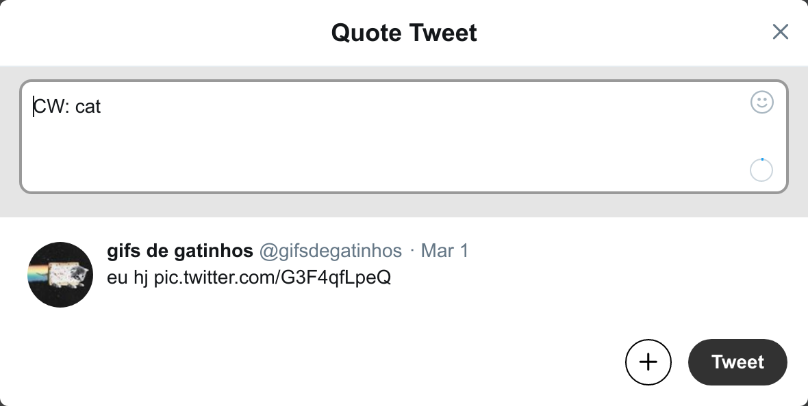
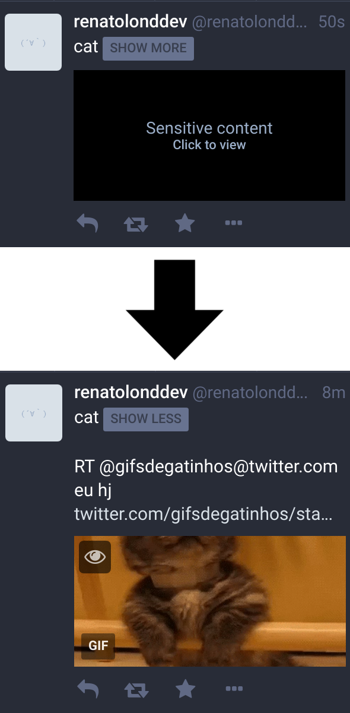

<p align="center"></p>


# Mastodon-Twitter Crossposter [](https://codeclimate.com/github/renatolond/mastodon-twitter-poster/maintainability) [](https://codeclimate.com/github/renatolond/mastodon-twitter-poster/test_coverage) [](https://travis-ci.org/renatolond/mastodon-twitter-poster) [](https://hosted.weblate.org/engage/mastodon-twitter-crossposter/)

This is an app for crossposting between Mastodon and Twitter. The app is made so that multiple users can connect to it using the OAuth interface from both Twitter and Mastodon and choose options on how the crosspost should work.

If you just want to use it, there's one running at https://crossposter.masto.donte.com.br, which you can use from whatever Mastodon server you are in

## Features

* Post from Twitter to Mastodon
  - You can choose between posting only your tweets, or also posting retweets and quotes.
  - You can choose between posting retweets and quotes as links or as the old-style RTs, starting by RT @username@twitter.com.
  - Quotes bigger than 500 characters are automatically split in two toots, one replying to the other.
  - Your own threads can also be crossposted!
  - No other replies will be posted. There's no risk of filling your Mastodon timeline with replies to people that are not there.
  - Possibility to add a content warning to all tweets being posted to Mastodon
  - Infer content warnings: if your tweet begins with a line containing "content warning" it will be posted behind a content warning on Mastodon. More information about which formats are supported can be seen below at [Experimental Content Warning recognition](#experimental-content-warning-recognition)
  - Blocklists or Allowlists: Only crosspost tweets containing one word from a list or do not crosspost tweets that contain at least one word from a list

* Post from Mastodon to Twitter
  - Any toot bigger than 280 characters will be posted with a link to the original toot. (Be careful, if you post your private toots, your followers might not be able to see the original post!)
  - Mind your privacy: you can choose which privacy levels you want to crosspost. Only posting public toots, for instance.
  - You can choose between posting boosts or not.
  - Your own threads can also be crossposted, respecting to the choices you made regarding your privacy.
  - No other replies will be posted. There's no risk of filling your twitter timeline with replies to people that are not there.
  - Blocklists or Allowlists: Only crosspost toots containing one word from a list or do not crosspost tweets that contain at least one word from a list

The crossposter will never follow anyone or post anything but the content you selected to be crossposted.

If you decide to crosspost from Twitter to Mastodon, remember to turn on notifications about when people mention you to avoid not seeing interactions!

## Note on usage

The crossposter is made with multiple users in mind. For that reason, it can be quite a lot of moving parts if you want to self-host yourself. There's other good tools to self-host out there like https://github.com/AmauryCarrade/MastodonToTwitter and the others listed at the [Bridges from/to other platforms section of the Mastodon apps](https://github.com/tootsuite/documentation/blob/master/Using-Mastodon/Apps.md#bridges-fromto-other-platforms). That being said, it should work even if you only want it for your own usage.

## Ruby on Rails

Ruby 2.5.1

Rails 5.1

## Requirements

Without extra configuration, a local postgres instance is needed. Node is needed for assets compilation, can be installed using [nvm](https://github.com/creationix/nvm).

The poster uses the [ruby-filemagic gem](https://github.com/blackwinter/ruby-filemagic) for detecting the types of the files posted. Follow the instructions described in the README to install the needed library and headers.

## Pre-setup

Mastodon tokens are generated by the application, but for twitter you need to request an API Token from their side. You need  consumer key (on our side TWITTER_CLIENT_ID) and consumer secret (on our side TWITTER_CLIENT_SECRET)

## Setup

Note: If you are running side-by-side with Mastodon or other sidekiq-using software, you need to configure redis to avoid issues with mixed jobs. More info at the end.

You need to install Yarn and Ruby 2.5.1. Yarn has installation instructions for several OSs here: https://yarnpkg.com/lang/en/docs/install/ and Ruby can be installed either using RVM (https://rvm.io/rvm/install) or rbenv (https://github.com/rbenv/rbenv#installation). After you have ruby and yarn setup, you'll need to do:

```
# Install bundler
gem install bundler
# Use bundler to install Ruby dependencies
bundle install --deployment --without development test
# Use yarn to install node.js dependencies
yarn install --pure-lockfile
```

A separate user is recommended.

If you want the crossposter to send data to a statsd instance, you need to configure the appropriate variables in the .env file. You can check the example for reference.

Before starting for the first time, you need to generate the assets and setup the database:

```
bundle exec rake db:setup # sets up the database
bundle exec rake assets:precompile # generates the assets
```

An example nginx configuration can be found at `util/nginx.conf`. It assumes the crossposter is running at port 3000, in the directory `/home/crossposter/live` and the domain `crossposter.example.com` needs to be replaced by your own.

An example of the configuration file is provided at `.env.example`. To generate `SECRET_KEY_BASE`, you need to run `bundle exec rake secret` and copy the resulting hash. You need to configure an app on Twitter with permission to read and write. The credentials that they give you need to be added to TWITTER_CLIENT_ID and TWITTER_CLIENT_SECRET. \\
If you're not using Librato, you don't need to fill any of the Librato variables.

To start the web app, you need to do:
`bundle exec puma -C config/puma.rb"`

If you are using systemd, you can create a service with something like:

```
[Unit]
Description=mastodon-twitter-crossposter
After=network.target

[Service]
Type=simple
User=crossposter
WorkingDirectory=/home/crossposter/live
Environment="RAILS_ENV=production"
Environment="RAILS_LOG_TO_STDOUT=enabled"
Environment="PORT=3001"
ExecStart=/bin/bash -lc "bundle exec puma -C config/puma.rb"
TimeoutSec=15
Restart=always

[Install]
WantedBy=multi-user.target
```
And put it on `/etc/systemd/system/crossposter.service`

And a second one like this:

```
[Unit]
Description=mastodon-twitter-crossposter-sidekiq
After=network.target

[Service]
Type=simple
User=crossposter
WorkingDirectory=/home/crossposter/live
Environment="RAILS_ENV=production"
Environment="RAILS_LOG_TO_STDOUT=enabled"
Environment="RAILS_MAX_THREADS=5"
ExecStart=/bin/bash -lc "bundle exec sidekiq -c 5 -q default"
TimeoutSec=15
Restart=always

[Install]
WantedBy=multi-user.target
```
And put it on `/etc/systemd/system/crossposter-sidekiq.service`
(note that RAILS_MAX_THREADS and the number of sidekiq threads should be the same)

These example files are provided in the `config/systemd-services` directory. You may copy these files (with necessary modifications, if applicable) to `/etc/systemd/system/` to run the system in the background.

### Running side-by-side with other sidekiq/redis applications

If you are running the crossposter on a server with other sidekiq/redis applications, you need extra configuration to make sure everything is separated.

For a more in-depth information, you can check out [Sidekiq Wiki](https://github.com/mperham/sidekiq/wiki/Using-Redis), but one thing you can do it's to use another redis db, which could be done by creating a file in `config/initializers/sidekiq.rb` with the content like

```
Sidekiq.configure_server do |config|
  config.redis = { url: 'redis://redis.example.com:7372/2' }
end

Sidekiq.configure_client do |config|
  config.redis = { url: 'redis://redis.example.com:7372/2' }
end
```

You need to replace all values with actual values relevant to your server.

## Blocked or allowed domains

You can add `ALLOWED_DOMAINS=your.domain.com` to .env.production to only allow users from your instance to access the crossposter. This variable can contain multiple instances separated by comma.

At the same time, you can add `BLOCKED_DOMAINS=evil.corp,bad.instance` to .env.production to block users from those instances to access the crossposter. They need to be separated by commas, spaces are optional.

You should only enable one at each time.

## Tests

Run `RAILS_ENV=test bundle exec rake db:setup` to create the test database (a postgres running locally is needed), and after that run the tests with `bundle exec rake test` (or `COVERAGE=1 bundle exec rake test` if coverage information is desired)

## Starting
To start the project locally, you can do `foreman start` which will start the webserver, or start it with `bundle exec rails s`. To start sidekiq, you need to start with `bundle exec sidekiq`. For production, you need sidekiq to process jobs (that is, to post accross the networks), but you only need the webserver if you want to change configurations or to allow new signups. If you're in a single user setup, you can start and stop the webserver as needed.

## Experimental Content Warning recognition
When posting from Twitter to Mastodon the Crossposter tries to detect content warnings in the tweets and post them over to Mastodon. The detected CW takes precedence over the default twitter one if exists. Some formats are supported and more can be added in the future, but currently, this are the ones that will be recognized:

```
CW: content warning
my tweet
```

```
TW: content warning
my tweet
```

```
CW/TW: content warning
my tweet
```

```
TW, CW, content warning
my tweet
```

```
Spoiler: content warning
my tweet
```

```
CN: content warning
my tweet
```

```
Contains: content warning
my tweet
```

```
Contém: content warning
my tweet
```

All of these posts will be posted in Mastodon with the same content: `my tweet` and will have a content warning of `content warning`. The crossposter attempts to remove any extra spaces between the `CW:` (or equivalent) tag.

This also works for quote-retweets. That is, if you are retweeting and you want to add a content warning to the tweet, you can just quote-retweet writing `CW: content warning`.



This does not work for several tweets in a thread. Each tweet needs to have it's own CW.

Even though this is an experimental feature, it cannot be disabled. The reason is that content warnings are important for people in Mastodon and the crossposter should still try to keep it in a good environment, even if bringing content from Twitter.

## Contributing

Mastodon Twitter Crossposter is **100% free** and **open source**. We encourage and support an active, healthy community that accepts contributions from the public &ndash; including you!

There's a high level description of the crossposter over at [development help](https://github.com/renatolond/mastodon-twitter-poster/wiki/Development-help). You can start there and ask questions as needed!

## License

Copyright (C) 2017-2018 Renato Cerqueira & other crossposter contributors

This program is free software: you can redistribute it and/or modify it under the terms of the GNU Affero General Public License as published by the Free Software Foundation, either version 3 of the License, or (at your option) any later version.

This program is distributed in the hope that it will be useful, but WITHOUT ANY WARRANTY; without even the implied warranty of MERCHANTABILITY or FITNESS FOR A PARTICULAR PURPOSE. See the GNU Affero General Public License for more details.

You should have received a copy of the GNU Affero General Public License along with this program. If not, see <https://www.gnu.org/licenses/>.
